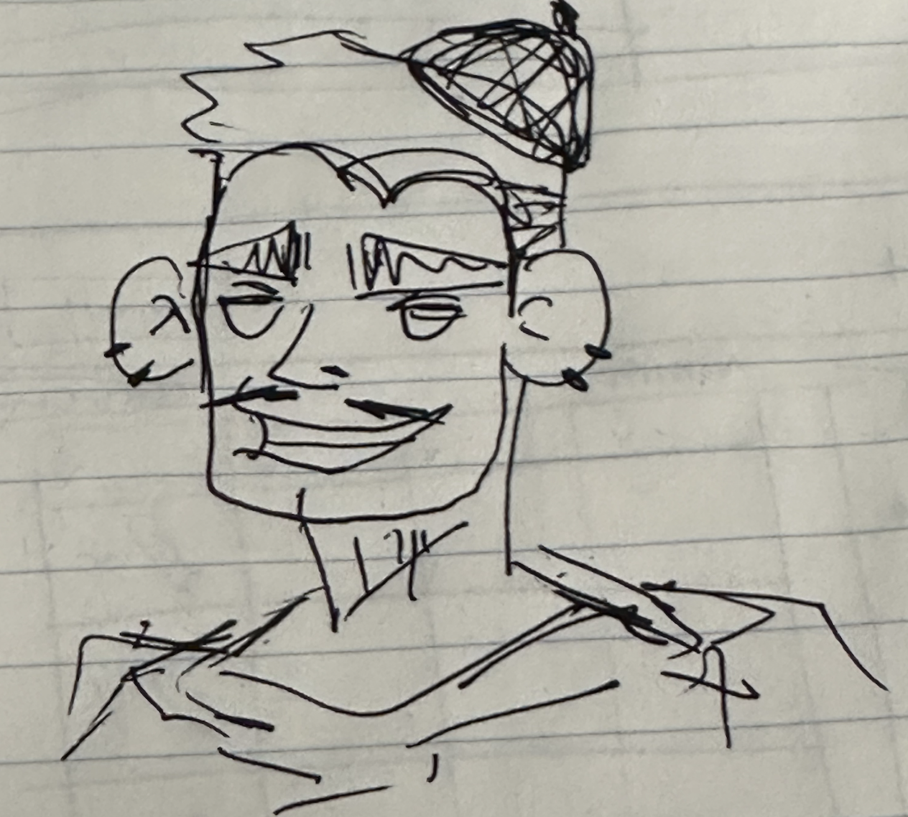

# Project 3, Milestone 1: **Consumer** Design Journey

[← Table of Contents](../design-journey.md)

## _Cohesive_ Audience
> Briefly explain your site's **consumer** audience.
> Your audience should be specific, but not arbitrarily specific.

The audience is art lovers who would like to look at drawings both digital and traditional

> Be specific and justify why this audience is a **cohesive** group. (1-2 sentences)

This audience is a cohesive group because they share similar goals of wanting to view art.

## Audience Goals
> Document your **consumer** audience's goals.
> List each goal below. There is no specific number of goals required for this, but you need
> enough to do the job (Hint: It's at least 1, but probably no more than 3).

Goal 1: Find a art style they like

Goal 2: Find different character art

## Persona

> Use the goals you identified to develop a persona of your site's **consumer** audience.
> Your persona must have a name and a face. The face can be a photo of a face or a drawing, etc.
> You may type out the persona below with bullet points or include an image of the persona.
> Just make sure it's easy to read the persona when previewing markdown.

Persona's Name: Billy

- Billy is a college student majoring in art.
- He likes to draw, and prefers digital artworks
- In his freetime he enjoys viewing stylized art outside of his class.
- He mainly uses his laptop to view artworks
- Enjoys browsing though instagram and pinterest to view different art.
- Needs to be able to see information about said art
- Needs to know when the art was created
- Needs to know if the art piece was given a name
- Obstacle: Enjoys browsing on wide screen since he has poor eyesight and cannot view artworks very well on smaller screens

## Contributors

I affirm that I am submitting my work for the consumer requirements in this milestone.

Consumer Lead: Nicole Lin

[← Table of Contents](../design-journey.md)
