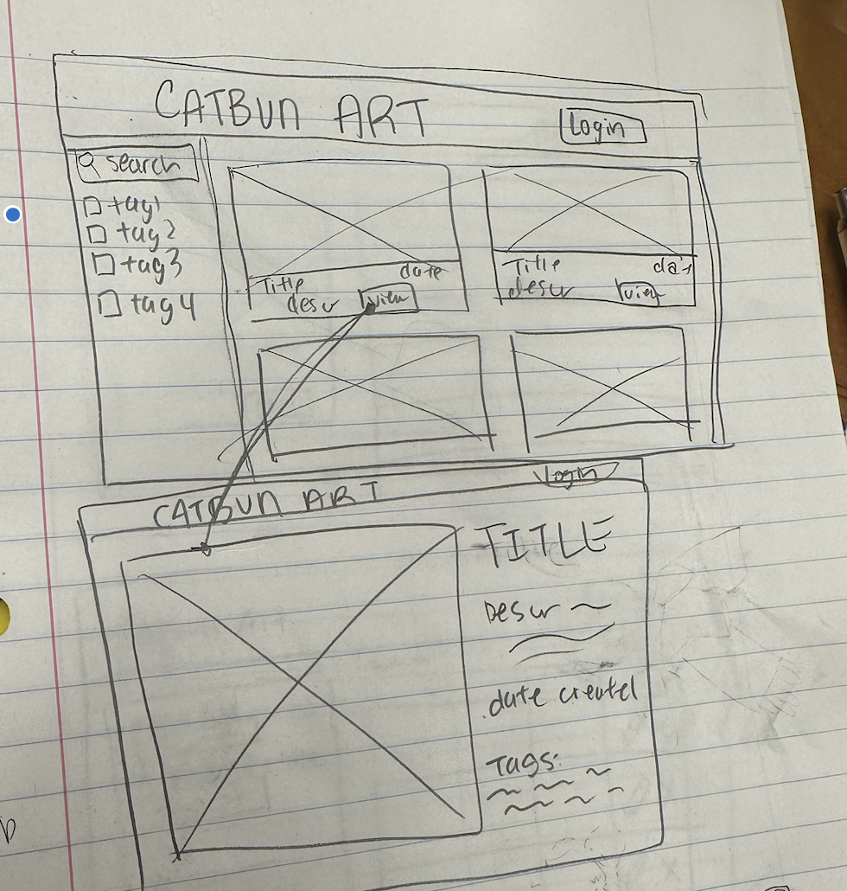
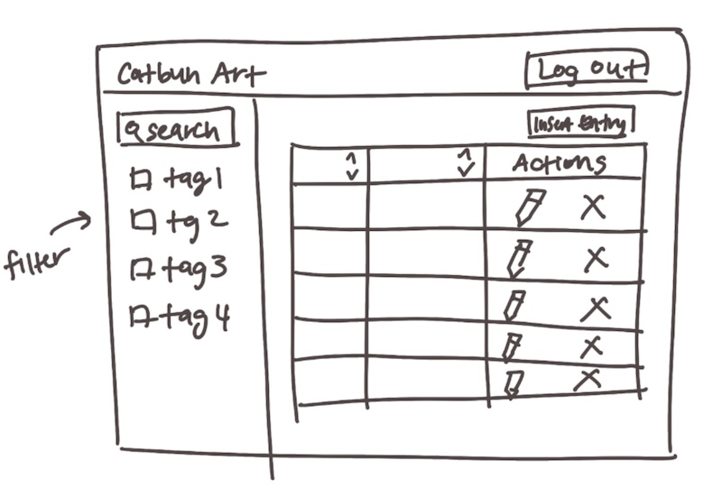
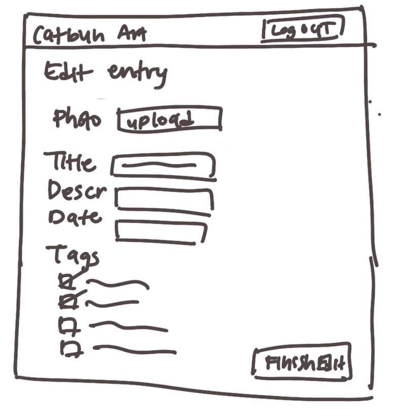
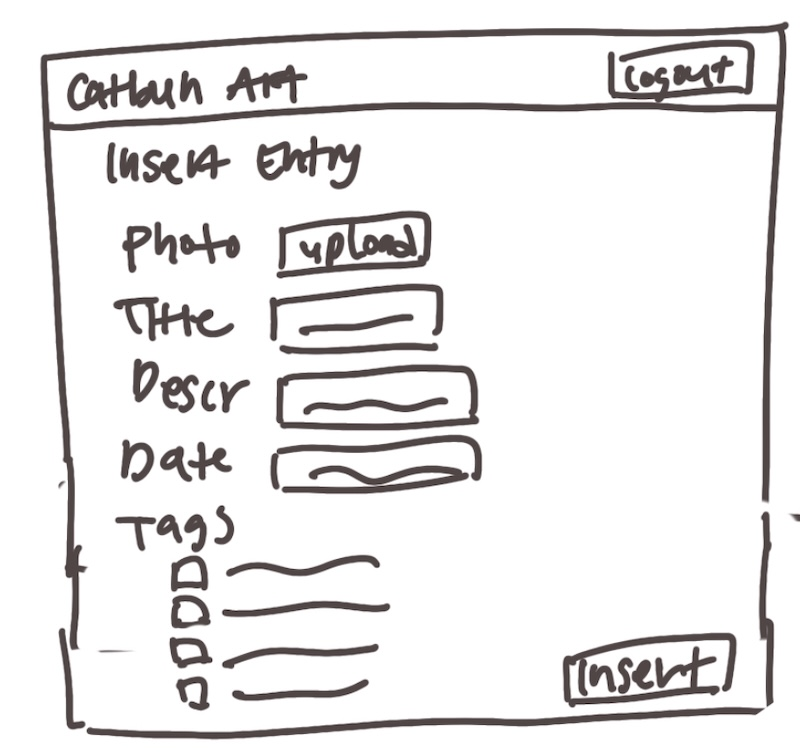

# Project 3, Milestone 1: **Team** Design Journey

[← Table of Contents](design-journey.md)

**Make the case for your decisions using concepts from class, as well as other design principles, theories, examples, and cases from outside of class (includes the design prerequisite for this course).**

You can use bullet points and lists, or full paragraphs, or a combo, whichever is appropriate. The writing should be solid draft quality.

## Catalog
> What will your catalog website be about? (1 sentence)

The catalog website will be an online art gallery space where the artist can publically display and tag their different works based on date completed, medium, and more.

## Narrow or Wide Screen
> How will your **consumer** user access this website? From a narrow or wide screen?

Wide screen

## Catalog Design
> Sketch each page of your entire media catalog website
> Provide a brief explanation _underneath_ each sketch. (1 sentence per sketch)
> **Refer to consumer or administrator persona by name in each explanation.**

Consumer:

Billy will be able to view each image and be able to see a quick overview of the artwork, as well as sort by name or tags. If Billy is interested in an artwork and would like to take a closer look, he simply has to press the view button to view a bigger image of the artwork and the title and description for the art.

Admin:

Update: For the first column of the table, there will be thumbnail image previews of the art Falin intends to insert into the table.

Falin will be able to view every entry that she input into the table, perform actions such as deleting and editing the already inserted entries, and filter through her entries by tags in the sidebar.

In the admin edit page, Falin will be able to edit an already existing entry and change the file, name, description, date, and tags associated with the old entry.

Falin will be able to create a new entry to be inserted into the table, and provide attributes such as the image file, name, description, date, and tags.

## Catalog Design Patterns
> Explain how your design employs common catalog design patterns. (1-2 sentences)

Our catalog employs a grid like view with 2 images on each row, so that each artwork can be viewed better; the grids will be the same size so it will be more organized and nicer to look at. For the admin design, our catalog will have alternating colors for rows to ensure readibility.

## URL Design
> Plan your HTTP routing.
> List each route and the PHP file for each route.

| Page                                     | Route       | PHP File       |
| ---------------------------------------- | ----------- | -------------- |
| home / consumer view all / filter by tag | /           | pages/home.php |
| consumer entry details                   | /consumer-entry | pages/consumer-entry.php |
| admin view all / filter by tag           | /admin-view | pages/admin-view.php |
| admin insert entry                       | /admin-insert | pages/admin-insert.php|
| admin edit entry / tag / untag           | /admin-edit | pages/admin-edit.php |
| login                                    | /login      | pages/login.php |

> Explain why these routes (URLs) are usable for your persona. (1 sentence)

These routes are usable for Billy because the searchbar will contain a short and concise information about where Billy is on the site (home or art entry); it will similarly be usable for Falin because the URLs contain information about their status as an admin and what actions they can perform on that page.

## Database Schema
> Plan the structure of your database. You may use words or a picture.
> A bulleted list is probably the simplest way to do this.
> Include constraints for each field.

**Table:** art

- id: INT {PK, U, NN, AI}
- title: TEXT {NN}
- descr: TEXT {none}
- year: INT {NN}
- file_path: TEXT {NN}

**Table:** tags

- id: INT {PK, U, NN, AI}
- name: TEXT {NN}

**Table:** art_tags

- id: INT {PK, U, NN, AI}
- art_id: {FOREIGN KEY (art_id) REFERENCES art(id)}
- tags_id: {FOREIGN KEY (tags_id) REFERENCES tags(id)}

## Contributors

I affirm that I have contributed to the team requirements for this milestone.

Consumer Lead: Nicole Lin

Admin Lead: Shihan Gao

[← Table of Contents](design-journey.md)
